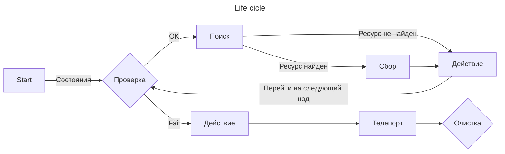
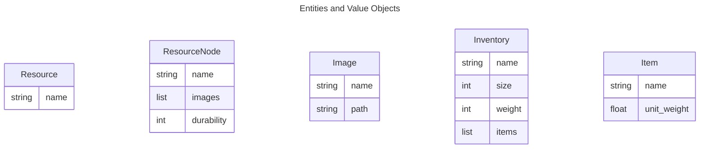

# AlbionBot

AlbionBot is a Python-based bot for the popular MMORPG, Albion Online. Using image recognition and machine learning, AlbionBot automates resource gathering, transportation, and crafting to help players optimize their in-game experience.

Built with Domain-Driven Design principles, AlbionBot's codebase is organized into distinct layers that separate business logic from infrastructure concerns. The domain layer contains the core logic of the bot, while the infrastructure layer handles external dependencies such as image recognition and database interactions.

Features of AlbionBot include:

- Automated resource gathering and transportation
- Crafting automation
- Win32 API integration for keyboard and mouse input
- Image recognition with OCR technology
- Customizable rules engine for defining bot behavior

## TODO

0. Семья
    - Определить порядок передачи информации/ресурсов
    
0. Тестирование
    - draw функций
    - Добавить изолированность, последовательность к input actions
1. Действия персонажа и цикл сбора:
    - ~~Адаптировать wind_mouse~~
    - Распознавание маунта
    - Состаяния mount/unmount
    - Распознавание монстров
    - Действие атака/сбор
2. Навигатор карты
3. Движение персонажа по навигатору
5. Threads/Async
10. Рефакторинг модуля мыши/клавиатуры
    - Создать апи
11. Рефакторинг модуля camera
    - поддержка изометрических игр
    - поддержка 1/3rd person games

## Алгоритм
---

### Сущности

    История об отце, матери и 3 детей, которые пошли в лес собирать грибы.
    Так уж получилось, что все они не ладят друг с другом и вынуждены передавать свои слова и идеи отцу, а он, в свою очередь, подходящим сыновьям.
    С ними ещё пошла мать, беспокоясь, чтобы семейство не заблудилось в лесу.

    Отец (Gatherer) -  говорит, какие грибы нужно собирать и передает слова одного брата другому.

    Мать (Watcher) - говорит семейству, когда смеркается и пора ехать обратно.

    Старший сын (Visionary) - занимается поиском грибов

    Сын помладше (Actionist) - собирает грибы и кучер по совместительству и вообще мастер на все руки

    Младшенький (Navigator) - молодой картограф

0. Абстрактные Bot
    - абстрактная сущность
    - содержит общие атрибуты, константы, методы
1. Bot Father
    - Определяет расписание
    - создаёт детей (менеджер процессов)
    - кормит детей (менеджер состояния)
    - приглашает наблюдателя (Watcher)
    - обработка и сохранение действий детей (логирование)
    - Изменение расписания детей (state)
    - Забирает результат (targets) и передает другому ребенку
2. Bot mother
    - Говорит, когда пора идти домой
4. Visionary
    - Ищет грибы и опасности
    - поиск объектов без или с state?
    - хватает картинку
    - ищет соответствия на картинке
5. Actionist
    - Определяет решение цели
    - действие в зависимости от state и targets
6. Navigator
    - прокладывает путь для отца и детей
    - указывает куда двигаться другому ребенку (action propagation)

### Цикл Gatherer

1. Старт
    - определить местонахождение
    - определить вес персонажа
    - определить износ экипировки
    - найти/вызвать и сесть на маунта

0. Если все хорошо, переход на поиск

2. Поиск
    - определить цель поиска
    - найти ресурс

0. Поиск -> Если ресурс не найден

3. Движение
    - определить местонахождение
    - переместиться на следующий node

0. Поиск -> Если ресурс найден

4. Подготовка
    - найти монстров поблизости
    - определить ближайший ресурс

0. Подготовка -> Если найден монстр

5. Зачистка
    - определить ближайшую цель
    - атака
    - подтверждение убийства
    - поиск целей n раз
    - переход в Поиск

0. Подготовка -> Если не найден монстр

6. Сбор
    - переместиться к ресурсу
    - слезть с лошади
    - собрать ресурс
    - залезть на лошадь
    - переход в Поиск

## GIT
---

    # Origin
    git remote add origin git@github.com:gupalovich/albion-bot.git

## Architecture
---

## Project structure
---

    bot/
    ├── app/
    │   ├── actions/
    │   │   ├── gather_resources.py
    │   │   ├── move_to_town.py
    │   │   ├── stash_resources.py
    │   │   └── craft.py
    |   ├── database/
    |   │   ├── migrations/
    |   │   ├── core.py
    |   │   ├── models.py
    |   │   ├── repositories.py
    |   │   └── unit_of_work.py
    │   ├── domain/
    │   │   ├── entities.py
    │   │   ├── rules.py
    │   │   └── value_objects.py
    │   ├── services/
    │   │   └── ocr.py
    │   └── bot.py
    ├── infra/
    │   ├── async/
    │   │   ├── asyncio.py
    │   │   └── threading.py
    │   ├── common/
    |   |   ├── decorators.py
    |   |   ├── entities.py
    │   │   └── utils.py
    │   ├── devices/
    |   |   ├── display/
    │   │   |   ├── camera.py
    │   │   |   └── window.py
    |   |   ├── input/
    │   │   |   ├── mouse.py
    │   │   |   └── keyboard.py
    |   |   ├── vision/
    │   │   |   ├── opencv.py
    │   │   |   └── tesseract.py
    ├── static/
    |   ├── icons/
    |   ├── items/
    |   └── ui/
    ├── main.py
    ├── config.ini
    └── README.md

## Neural network training
---

1. Install YOLO5
    - `git clone https://github.com/ultralytics/yolov5.git`
    - `cd yolov5`
    - `pip install -r requirements.txt`

2. Install
    - CUDA Toolkit 11.5
    - TensorRT 8.6.1
        - Add path to system path variables `\TensorRT-8.6.1.6\lib`
    - zlib
        - Add path to system path variables `\zlib123\dll_x64`
    - cuDNN 8.9.0
        - Add path to system path variables `\cudnn-8.9.0.131_cuda11\bin`

3. Install PyTorch with cuda support
    - `pip install torch==1.11.0+cu115 torchvision==0.12.0+cu115 torchaudio==0.11.0 --extra-index-url https://download.pytorch.org/whl/cu115`

4. Train model
    - `python train.py --img 640 --batch 2 --epochs 240 --data ../data/ready_data.yaml --weights yolov5s.pt --cache --device 0 --workers 2`

5. Test trained model
    - `python detect.py --weights runs/train/exp/weights/best.pt --img 640 --source ../data/test_data/ --conf-thres 0.65`

6. Export model (TensorRT required)
    - Path to model: `runs/train/exp/weights/best.pt`
    - `python export.py --weights ../best.pt --include engine --half --device 0`

7. Errors
    - Not enough virtual memory (добавить/разрешить файл подкачки)
    - YOLO permission denied (in yolo dir):
        - `git init`
        - `git config --global --add safe.directory D:/work/albionbot/yolov5`
        - `git pull`

## Version
---

    0.0.6 (12.06.2023)
        - Core parts are mostly complete

    0.0.5 (10.06.2023)
        - Restructure project architecture

    0.0.4 (20.05.2023)
        - Custom YOLO model for ingame object detection 
        - Update infra module

    0.0.3 (16.05.2023)
        - Added infra module

    0.0.2 (10.05.2023)
        - New project structure

    0.0.1 (09.05.2023)
        - Init project
