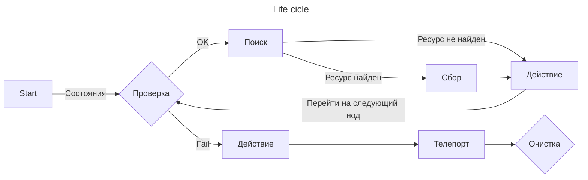
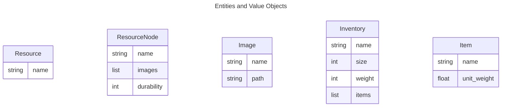

# AlbionBot

AlbionBot is a Python-based bot for the popular MMORPG, Albion Online. Using image recognition and machine learning, AlbionBot automates resource gathering, transportation, and crafting to help players optimize their in-game experience.

Built with Domain-Driven Design principles, AlbionBot's codebase is organized into distinct layers that separate business logic from infrastructure concerns. The domain layer contains the core logic of the bot, while the infrastructure layer handles external dependencies such as image recognition and database interactions.

Features of AlbionBot include:

- Automated resource gathering and transportation
- Crafting automation
- Win32 API integration for keyboard and mouse input
- Image recognition with OCR technology
- Customizable rules engine for defining bot behavior

## TODO

1. ~~Работа с окном - хелперы~~
1. Дизайн основых сущностей домена
    - ~~Value Objects~~
    - Entities
2. Инфраструктура мыши/клавиатуры
2. OCR
    - CV сервис
    - Дополнительная нн для разпознавания ресурсов
3. Actions
6. Camera refactor
4. Threads/Async
5. Жизненный цикл бота

## GIT
---

    # Origin
    git remote add origin git@github.com:gupalovich/albion-bot.git

## Architecture
---

## Project structure
---

    bot/
    ├── app/
    │   ├── actions/
    │   │   ├── gather_resources.py
    │   │   ├── move_to_town.py
    │   │   ├── stash_resources.py
    │   │   └── craft.py
    |   ├── database/
    |   │   ├── migrations/
    |   │   ├── core.py
    |   │   ├── models.py
    |   │   ├── repositories.py
    |   │   └── unit_of_work.py
    │   ├── domain/
    │   │   ├── entities.py
    │   │   ├── rules.py
    │   │   └── value_objects.py
    │   ├── services/
    │   │   └── ocr.py
    │   └── bot.py
    ├── infrastructure/
    |   ├── asyncio.py
    |   ├── config.py
    |   ├── threading.py
    │   └── win32api.py
    ├── static/
    |   ├── icons/
    |   ├── items/
    |   └── ui/
    ├── main.py
    ├── config.ini
    └── README.md

## Version
---

    0.0.2 (10.05.2023)
        - New project structure

    0.0.1 (09.05.2023)
        - Init project
