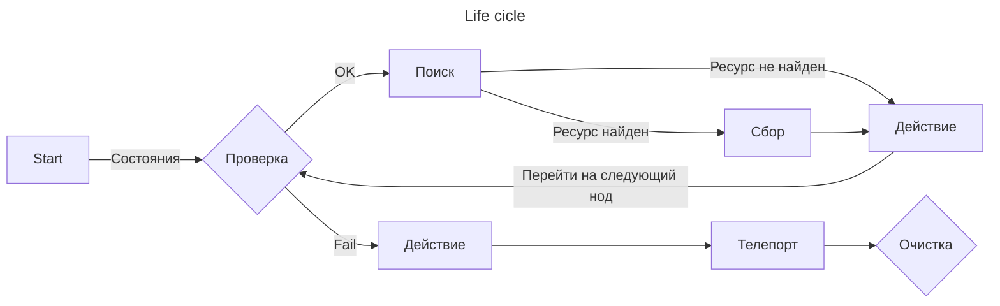

# Compendium

Compendium is a Python-based framework for creating bots using AI vision technology. It provides a comprehensive set of tools and libraries to simplify the development of automation bots that rely on image recognition and machine learning.

Key Features of Compendium:

- Powerful AI Vision: Utilize advanced image recognition and machine learning algorithms to analyze and interpret visual data.
- Flexible Bot Creation: Build bots for various applications and games, leveraging AI vision capabilities for automation tasks.
- Domain-Driven Design: Apply the principles of DDD to organize your bot's codebase into distinct layers, separating business logic from infrastructure concerns.
- Extensive Documentation: Access detailed documentation and tutorials to guide you through the bot creation process.
- Customizable Rules Engine: Define and customize bot behavior using a flexible and intuitive rules engine.
- Win32 API Integration: Seamlessly integrate with the Win32 API to control keyboard and mouse input for precise automation.
- Scalable and Performant: Design and develop bots that can handle large-scale tasks efficiently.

## TODO

0. Рефактор
    - BotChild targets добавить типы

0. Тестирование
    - Добавить изолированность к input actions
1. Действия персонажа и цикл сбора:
2. Навигатор карты
    - Тестирование
10. Рефакторинг модуля мыши/клавиатуры
    - Создать апи
11. Рефакторинг модуля camera
    - поддержка изометрических игр
    - поддержка 1/3rd person games

## GIT
---

    # Origin
    git remote add origin git@github.com:gupalovich/compendium.git

## Architecture
---

## Neural network training
---

1. Install YOLO5
    - `git clone https://github.com/ultralytics/yolov5.git`
    - `cd yolov5`
    - `pip install -r requirements.txt`

2. Install
    - CUDA Toolkit 11.5
    - TensorRT 8.6.1
        - Add path to system path variables `\TensorRT-8.6.1.6\lib`
    - zlib
        - Add path to system path variables `\zlib123\dll_x64`
    - cuDNN 8.9.0
        - Add path to system path variables `\cudnn-8.9.0.131_cuda11\bin`

3. Install PyTorch with cuda support
    - `pip install torch==1.11.0+cu115 torchvision==0.12.0+cu115 torchaudio==0.11.0 --extra-index-url https://download.pytorch.org/whl/cu115`

4. Train model
    - `python train.py --img 640 --batch 2 --epochs 240 --data ../data/ready_data.yaml --weights yolov5s.pt --cache --device 0 --workers 2`

5. Test trained model
    - `python detect.py --weights runs/train/exp/weights/best.pt --img 640 --source ../data/test_data/ --conf-thres 0.65`

6. Export model (TensorRT required)
    - Path to model: `runs/train/exp/weights/best.pt`
    - `python export.py --weights ../best.pt --include engine --half --device 0`

7. Errors
    - Not enough virtual memory (добавить/разрешить файл подкачки)
    - YOLO permission denied (in yolo dir):
        - `git init`
        - `git config --global --add safe.directory D:/work/albionbot/yolov5`
        - `git pull`

## Version
---

    0.0.7 (19.06.2023)
        - Complete albion bot - Gatherer state loop

    0.0.6 (12.06.2023)
        - Core parts are mostly complete

    0.0.5 (10.06.2023)
        - Restructure project architecture

    0.0.4 (20.05.2023)
        - Custom YOLO model for ingame object detection 
        - Update infra module

    0.0.3 (16.05.2023)
        - Added infra module

    0.0.2 (10.05.2023)
        - New project structure

    0.0.1 (09.05.2023)
        - Init project
